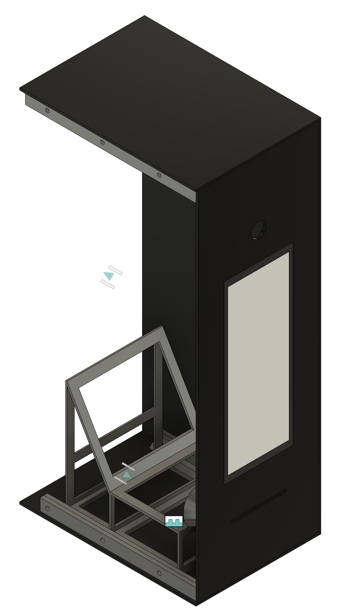
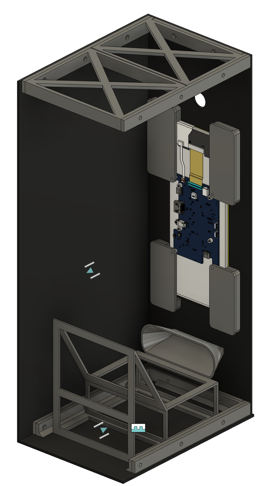

# 1-bit photobooth for xHain 38C3 assembly

You've seen it, you've used it, some of you have even loved it!
Now come and see how it's made!!!!11

## Hardware

### Off-the-shelf parts

- Raspberry Pi 4 B
- HP Webcam 320
- Waveshare 1600x600 LCD display with touch
- Brother QL-720NW thermal label printer
- 62mm endless sticker paper rolls
- usb cables, power bricks for the above etc.

### Enclosure

Use Autodesk Fusion (sorry) archive file: [`photo box 38c3.f3z`](enclosure/photo%20box%2038c3.f3z)

Panels were laser-cut, use 3 mm thick PMMA.

The version seen at 38c3 did NOT have the dark 
transparent panel on the front.

Connector pieces can be printed in PETG or PLA,
I used PETG because that's what I had ready to go in the dryer.
I glued them to laser-cut acrylic panels using "UHU HART KUNSTSTOFF" glue.

## Software

Requires reasonably-recent python3, and a systemd-based OS on the Pi.

For the Congress I went with the most default option of Raspberry Pi OS,
nothing fancy this year lmao.

See [`install`](install) for commands I used to get it running.

## issues found out during congress and TODOs

- prints get very curly and don't wanna exit through
  the slot in the bottom unless there's a bit of tape
  between the printer and slot itself
- the printer will not automatically go online
  after power loss, you must press the power button
- printer also goes to sleep automatically after N hours :/ 
  hence the sketchy cron job to print a 1-pixel line once in a while
- weird communication failures in logs when the printer is
  placed inside the enclosure (so i put it outside)
- i forgor to make it `Restart=always` 💀 in the unit file
- the display is very nice and bright, the resulting print needs
  more brightness
- needs some better light or larger f-stop camera to work in ccc darkness
  tip to use the a phone flashlight was actually very good and creative, thanks 
- i didn't have time to glue on a front panel to hide the gaps a bit better
- general error handling could be better
